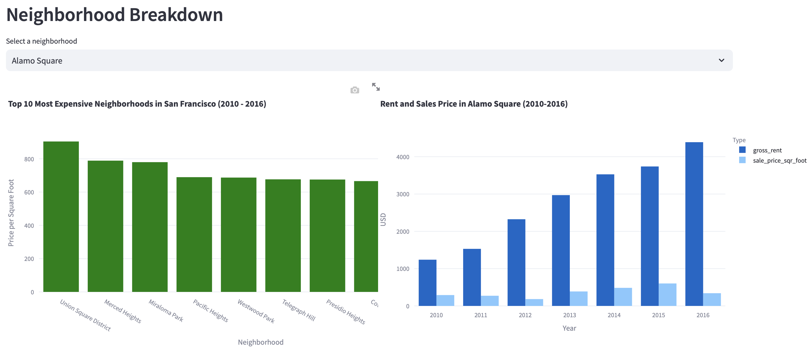
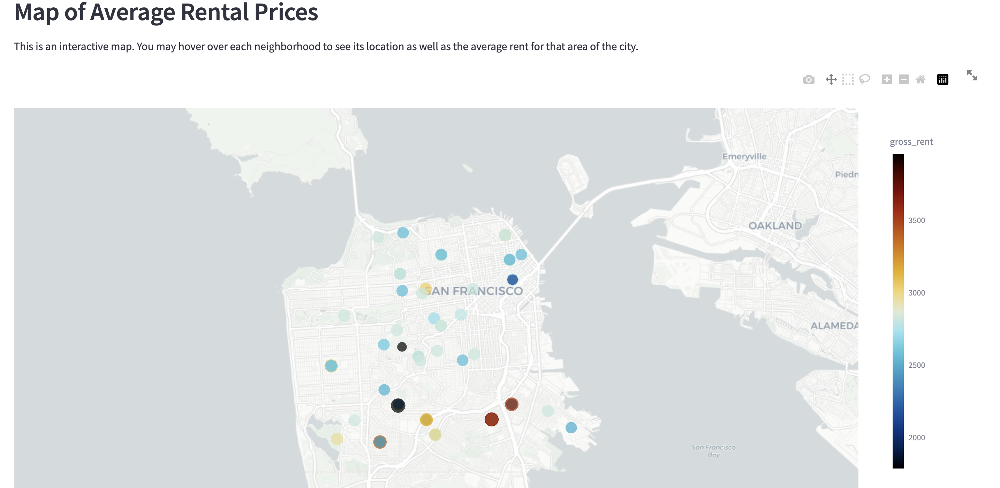

# Real Estate Dashboard
This repository contains the code to run a Streamlit app that will allow you to analyze data on rental properties in San Francisco from 2010 - 2016.  Instructions on how to run the Streamlit app are proved below.

## Streamlit App Instructions
### Creating a Virtual Environment (optional)
Though not required, it's probably a good idea to set up a virtual environment on your computer that you can then use to run the Streamlit app.  This will allow you to customize your Python version and install libraries/packages outside of your local machine which can help to avoid conflicts.
- [Instructions on Creating a Virtual Environment](https://www.freecodecamp.org/news/how-to-setup-virtual-environments-in-python/)

### Installing Streamlit
The official Streamlit documentation includes a helpful guide on how to install Streamlit.  The instructions range from beginner level to the tech-savvy.  You will need to install Streamlit in order to run the code to generate the app.
- [How to Install Streamlit](https://docs.streamlit.io/get-started/installation#)

### Running the App
Once you have installed Streamlit on your machine, download the [dashboard.py](Code/dashboard.py) file to a folder of your choice (or clone this respository to your machine to access the file).  In Terminal, navigate to the directory where the "dashboard.py" file is located, and then enter the following command:
```
streamlit run dashboard.py
```
This will open up a browser window where you can interact with the app.

## Real Estate Dashboard App
The app itself contains a few tabs:
1. An Intro tab that provides a brief outline of the app's contents 
2. Additional analysis tabs that show Supply and Demand charts for neighborhoods in San Francisco, as well as a tab that allows the user to see rent and sales price per sq foot information for specific neighborhoods 
3. An interactive map where you can see average rent breakdown by neighborhoods on a geographic map of San Francisco 

I hope this app is a useful tool in analyzing some real estate trends in San Francisco.
